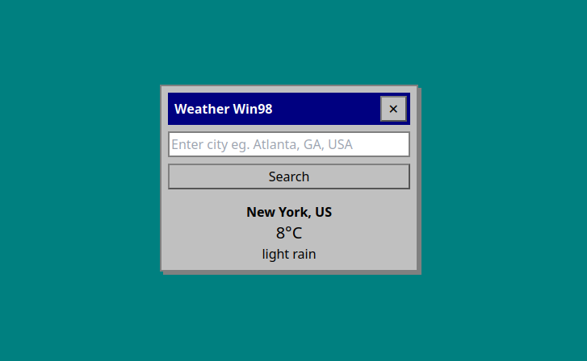

# Weather - Win98 Style 🌤️

A weather application that brings back the classic Windows 98 aesthetic. Search weather conditions for cities worldwide.



## ✨ Features

- **Retro UI Design**: Authentic Windows 98-inspired interface with classic buttons and dialogs.
- **City Search**: Find weather by city name (e.g., "London, UK" or "Paris, FR").
- **Dynamic Weather Display**: Shows temperature (°C), conditions, and city name.
- **Celebration Confetti**: Win98 style confetti animation on successful weather fetch.
- **Responsive Design**: Works seamlessly on modern browsers.

## 🛠️ Tech Stack

- **Frontend**: HTML5, JavaScript
- **Styling**: Tailwind CSS (with custom Win98 theme)
- **HTTP Client**: Axios
- **Weather API**: OpenWeatherMap
- **Effects**: Canvas Confetti

## 🚀 Getting Started

### Prerequisites

- Modern web browser
- [OpenWeatherMap API Key](https://openweathermap.org/api) (free tier)

## Customization

- You can modify the `API_KEY` in the JavaScript file to use your own OpenWeatherMap API key.
- Customize the colors and UI by modifying the Tailwind CSS classes in the `index.html` file.

## Folder Structure

```bash
📁 weather-app
├── 📄 index.html       # HTML file
├── 📄 script.js        # App logic
├── 📄 screenshot.png   # App Screenshot
└── 📄 README.md        # Project description
```

## ✨ Contribution

If you'd like to contribute to this project, feel free to submit issues or pull requests. Contributions are always welcome to improve this repository further!
